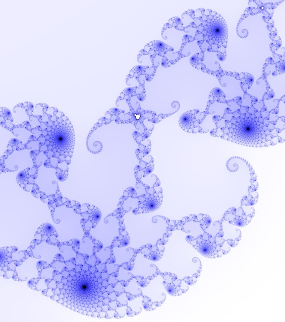
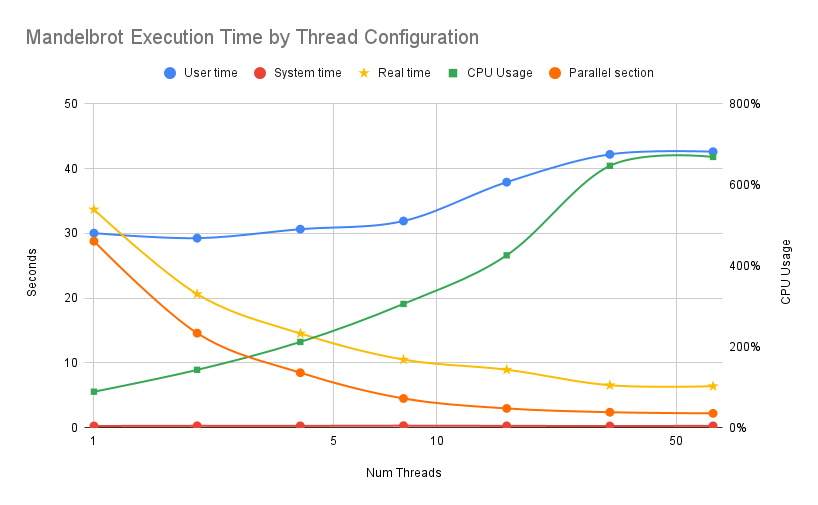

# Mandelbrot Fractal Evaluations

The Mandelbrot set is a complex and infinitely intricate mathematical fractal defined by the iterative function $z_{n+1}=z_n^2+c$, where $z$ and $c$ are complex numbers. Visualizing it with C++ involves calculating whether each point on a grid of complex numbers remains bounded under iteration, and translating these results into color values to render a captivating fractal image.

## Overview

A low-resolution sample image is provided below. The original file size occupies _52MB_ of storage as a `.png` file and _436MB_ as a `.ppm`!



In this exercise, we were interested in optimizing the performance of `C++` code to produce the correct result in a timely manner. The yellow line with stars represents the real time a human would spend waiting for the program to finish. Dividing the problem into smaller chunks (threads) which could run concurrently improved performance, with severely dimishing returns after maxing out the hardware capabilities of the lab machines.



_**Amdahl's Law** of Speedup Performance_ declares that a program can be sped up only as much as portions ($0\le p\le 1$) of the total baseline execution $T$ can be correctly parallelized and evaluated within the physical limits $k$ of a computer.

$$T_{k}=\frac{pT}{k}+\left(1-p\right)T$$

The results show that **≈80.5%** of this Mandelbrot program can be parallelized which yields a theoretical minimum run time of **6.57 seconds**.
The algorithm runs with **57.9%** efficiency on 4 threads; this efficiency quickly decreases while approaching and surpassing the processor capacity of 20 cores.

## Commands Used

```shell
# Make the binaries
make

# Draw the picture at specific coordinates
make draw COORDS="-1.75 0.75 -1.25 1.25"
make draw THREADS=32 SIZE="1000 8192" COORDS="-1.75 0.75 -1.25 1.25"

# Evaluate sequential execution
make sequential

# Evaluate parallel execution
make parallel THREADS=8

# Convert image for viewing
make png

# Cleanup
make clean
```

Correct answer SHA1SUM:
```txt
04c0e2cf0a9e2cbc58c4d16348ef4e3be2c46efc
```

## Evaluations

Extracted performance data from individual program evaluations.

| Num <br>Threads | User<br>time | System<br>time | **Real<br> time** | CPU<br>Usage | Parallel<br>section |
| :-- | :---: | :--: | :-----: | :--: | :-------- |
| Seq | 28.41 | 0.29 | 0:33.18 |    ? |         ? |
| 1   | 30.05 | 0.27 | 0:33.70 |  89% | 28.808434 |
| 2   | 29.27 | 0.30 | 0:20.64 | 143% | 14.608910 |
| 4   | 30.66 | 0.29 | 0:14.55 | 212% |  8.495725 |
| 8   | 31.92 | 0.32 | 0:10.52 | 306% |  4.519520 |
| 16  | 37.92 | 0.29 | 0:08.96 | 426% |  2.982503 |
| 32  | 42.21 | 0.27 | 0:06.56 | 647% |  2.399604 |
| 64  | 42.62 | 0.29 | 0:06.41 | 669% |  2.225711 |

## Speedup Analysis

A look at the speedup and efficiency metrics resulting from the experience.

### Speedup and Efficiency

Definition of **speedup** where $T_n$ represents the running time of the program on $n$ cores.
For the truest baseline, $T_1$ should be calculated using a raw sequential version of the program.

$$S_p=\frac{T_1}{T_p}$$

Usage of **gain** which represents the increase in speedup compared to the previous datapoint for $p\ge2$.
Since each $p$ value is _double_ the value before it, we would also expect _double_ the speedup if there were no overhead in parallelization.

$$G_p=\frac{S_p}{S_{p-1}}$$

Definintion of **efficiency** which measures the overhead due to parallelization and is reported as a percentage.

$$E_p=\frac{S_p}{p}=\frac{T_1}{pT_p}$$

Calculated results:

| Num <br>Threads | Real<br>Speedup | Real<br>Gain | Real<br>Efficiency | Parellel<br>Speedup | Parellel<br>Gain | Parallel<br>Efficiency |
| :- | --: | ---: | -----: | ---: | ---: | ----: |
| 1  | 1.0 |      | 100.0% |  1.0 |      |  3.3% |
| 2  | 1.6 | 1.63 |  81.6% |  2.0 | 1.97 |  6.7% |
| 4  | 2.3 | 1.42 |  57.9% |  3.4 | 1.72 | 11.1% |
| 8  | 3.2 | 1.38 |  40.0% |  6.4 | 1.88 | 20.0% |
| 16 | 3.8 | 1.17 |  23.5% |  9.7 | 1.52 | 25.5% |
| 32 | 5.1 | 1.37 |  16.1% | 12.0 | 1.24 | 28.4% |
| 64 | 5.3 | 1.02 |   8.2% | 12.9 | 1.08 | 30.4% |

### Algorithmic Limits

Amdahl's Law of Speedup Performance:

$$T_{k}=\frac{pT}{k}+\left(1-p\right)T$$

Where:
* $T$ is the total sequential time
* $p$ is the fraction of total that can be sped up ($0\le p\le 1$)
* $k$ is the speedup factor

Homework provided equation:

$$T_{\alpha}=\frac{pT}{\alpha}+\left(1-p\right)T$$

> [!NOTE]
> How did we make the leap from discussing $k$ in terms of speedup factor to discussing $\alpha$ which represents a particular instance?

Where
* $\alpha$ is the speedup of the parallel region only
  * Substituted with $S_{4}\approx3.4$
* $p$ is the fraction of original run time that is parallelizable
  * Our unknown variable
* $T_{\alpha}$ is the runtime for threads=4
  * Substituted with $T_{4}\approx14.55$
* $T$ is the total runtime with threads=1
  * Substituted with $T_{1}\approx33.70$

Algebraically solved for $p$:

$$p=\frac{\frac{T_{a}a}{T}-a}{1-a}\approx80.5\%$$

Interpretation:
Approximately **80.5%** of the Mandelbrot equation is currently parallelizable. The wall time for this portion could be divided by leveraging additional compute cores. The remaining 19.5% of the computational work remains sequential and cannot be sped up by leveraging additional compute resources.

Estimating the minimum bound for overall run time with infinity compute resources:

$$\lim_{k \to \infty}\frac{pT}{k}+\left(1-p\right)T$$

$$=\left(1-p\right)T$$

$$\approx6.57\text{ seconds}$$

Interpretation:
The theoretical minimum bound for evaluating this program with infinite resources is **6.57 seconds**.

## Raw Output Logs

Below are the raw output logs from various runs of the program.

### Serial program

```shell
time ./mandelbrot 0.27085 0.27100 0.004640 0.004810 1000 8192 pic.ppm

real	0m33.182s
user	0m28.414s
sys	0m0.289s
```

### Parallel program

```shell
#### 1 thread

OMP_NUM_THREADS=1 time ./mandelbrot-par 0.27085 0.27100 0.004640 0.004810 1000 8192 pic.ppm
TIME: 28.808434
30.05user 0.27system 0:33.70elapsed 89%CPU (0avgtext+0avgdata 298956maxresident)k
0inputs+891272outputs (0major+74361minor)pagefaults 0swaps

#### 2 threads

OMP_NUM_THREADS=2 time ./mandelbrot-par 0.27085 0.27100 0.004640 0.004810 1000 8192 pic.ppm
TIME: 14.608910
29.27user 0.30system 0:20.64elapsed 143%CPU (0avgtext+0avgdata 298936maxresident)k
0inputs+891272outputs (0major+74363minor)pagefaults 0swaps

#### 4 threads

OMP_NUM_THREADS=4 time ./mandelbrot-par 0.27085 0.27100 0.004640 0.004810 1000 8192 pic.ppm
TIME: 8.495725
30.66user 0.29system 0:14.55elapsed 212%CPU (0avgtext+0avgdata 298680maxresident)k
0inputs+891272outputs (0major+74367minor)pagefaults 0swaps

#### 8 threads

OMP_NUM_THREADS=8 time ./mandelbrot-par 0.27085 0.27100 0.004640 0.004810 1000 8192 pic.ppm
TIME: 4.519520
31.92user 0.32system 0:10.52elapsed 306%CPU (0avgtext+0avgdata 297896maxresident)k
0inputs+891272outputs (0major+74377minor)pagefaults 0swaps

#### 16 threads

OMP_NUM_THREADS=16 time ./mandelbrot-par 0.27085 0.27100 0.004640 0.004810 1000 8192 pic.ppm
TIME: 2.982503
37.92user 0.29system 0:08.96elapsed 426%CPU (0avgtext+0avgdata 297616maxresident)k
0inputs+891272outputs (0major+74388minor)pagefaults 0swaps

#### 32 threads

OMP_NUM_THREADS=32 time ./mandelbrot-par 0.27085 0.27100 0.004640 0.004810 1000 8192 pic.ppm
TIME: 2.399604
42.21user 0.27system 0:06.56elapsed 647%CPU (0avgtext+0avgdata 297704maxresident)k
136inputs+891272outputs (3major+74425minor)pagefaults 0swaps

#### 64 threads

OMP_NUM_THREADS=64 time ./mandelbrot-par 0.27085 0.27100 0.004640 0.004810 1000 8192 pic.ppm
TIME: 2.225711
42.62user 0.29system 0:06.41elapsed 669%CPU (0avgtext+0avgdata 289388maxresident)k
56inputs+891272outputs (1major+74493minor)pagefaults 0swaps
```
